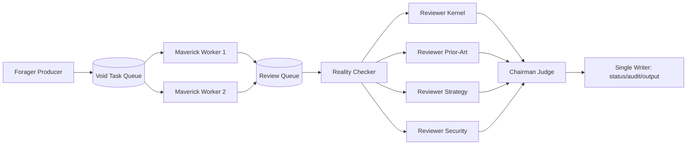

# DeepThought TODO List

Last Updated: 2026-04-07

## Immediate Actions
- [ ] Commit all pending changes (tests/scripts/docs/observability) as a clean batch before the next cleanup wave.
- [ ] Perform targeted cleanup for suspicious `kernel_source` legacy records (commit-message/hash-like labels) after current commit lands.

## Immediate Roadmap (P0-P3)
- [ ] P0: Choose operating mode for this week (`run_pipeline.py` single-run vs `run_pipeline_service.py` always-on)
- [ ] P0: Lock one baseline command and keep it as smoke-test reference
- [ ] P0: Complete long-run soak test until first `APPROVED` TID with Copilot backend (`--once` semantics)
- [ ] P1: Keep service mode running and confirm stable `pipeline_runs.jsonl` growth
- [ ] P1: Keep email notifications disabled during stabilization (`tid_email_notifications_enabled=false`)
- [ ] P2: Add process supervision (systemd/supervisor) and auto-restart policy
- [ ] P2: Add log rotation and retention policy for long-running service
- [ ] P3: Productionize prior-art conflict detector and claim confidence scoring
- [x] P0: Enable host-side Copilot CLI backend (`LLM_BACKEND=copilot_cli`)
- [x] P0: Enforce strict export gate (`APPROVED` only)
- [x] P1: Add ruthless culling (`fatal_flaw`, three-strikes, stage-failure red card)
- [x] P1: Add virtual patent committee consensus (4 specialists + chairman + veto rules)

## Pipeline Parallelism Refactor (Throughput First)
- [ ] P0: Parallelize Debate Panel specialist reviewers (I/O concurrency), keep chairman as single deterministic reducer.
- [ ] P0: Decouple Forager producer from Maverick/Reviewer consumers using queue-based orchestration.
- [ ] P1: Add a single-writer sink for status/audit/output to avoid multi-worker file contention.
- [ ] P1: Add worker limits and queue backpressure controls to prevent DB/CLI contention spikes.
- [ ] P1: Add `pipeline_parallel_mode` switch with safe defaults (e.g., reviewer_workers=4, maverick_workers=2).
- [ ] P2: Parallelize triad pair scoring and batch co-occurrence checks in Forager math stage.
- [ ] P2: Add throughput observability (stage p95 latency, queue depth, fail rate, round duration).

## Phase 1: Foundation
- [x] Environment setup and verification
- [x] Vector DB initialization (ChromaDB)
- [x] Tree-sitter integration for C / Rust parsing
- [x] Basic RAG pipeline with LlamaIndex

## Phase 2: Data Ingestion
- [x] Linux Kernel crawler (arch/x86, sched, mm, bpf)
- [x] Intel SDM PDF parser
- [x] LKML mailing list parser
- [x] Kconfig dependency graph builder
- [x] ArXiv paper ingestion (cs.AR, cs.OS, cs.PF)
- [ ] USPTO patent ingestion
- [x] Incremental update scheduler

## Phase 3: Core Engine
- [x] DeepThought Equation implementation
- [x] Topological Void detector
- [x] **Refactor MMR to Hybrid BGE-M3 Triad Equation** (Dense + Sparse)
- [x] **Deploy Elasticsearch / SQLite FTS5** sidecar for true global co-occurrence checks
- [x] **Implement Historical First-Collision Calibration** to dynamically set marginality thresholds (`tau_low`, `tau_high`)
- [x] Concept arithmetic (Latent Space Arithmetic)
- [ ] Void landscape visualization (UMAP 2D projection)

## Phase 4: Agent Pipeline
- [x] LangGraph State Machine skeleton
- [x] Forager Agent
- [x] Maverick Agent (`copilot_cli`)
- [x] Reality Checker Agent (`copilot_cli`)
- [x] **Integrate Global Patent API** (Google Patents / Semantic Scholar) for prior-art fast-screening
- [x] **Implement Conference Review Simulated Framework** (feedback reviewer metrics to Maverick for multi-generation mutation)
- [x] Debate Panel (`copilot_cli` role-conditioned committee)
- [x] Hallucination guard via committee fact-check retrieval and fatal-flaw rejection
- [x] Human-in-the-loop review checkpoint

## Phase 5: Output
- [x] TID template engine
- [x] Patent claim auto-generator
- [x] Prior art conflict detector
- [x] Confidence scoring per claim
- [x] Export to DOCX / PDF

## Phase 6: Production Hardening
- [x] Full audit logging
- [x] Incremental void tracking over time
- [x] Service mode for continuous execution
- [x] New TID email notification hook (SMTP)
